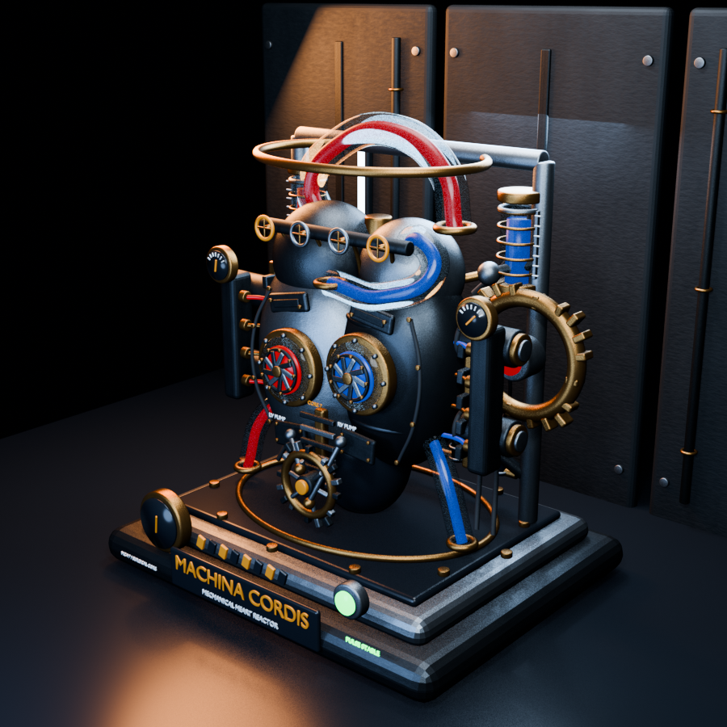

# MACHINA CORDIS

An animated mechanical heart reactor built entirely in Blender.



MACHINA CORDIS is a fictional surgical machine constructed from brushed titanium pressure chambers, synchronized linear actuators, mechanical iris valves, glass vascular conduits, and two exposed timing systems. Its front crank train converts a rotating 16-tooth flywheel into articulated reciprocating motion while hydraulic manifolds, damped gauges, manual trim valves, pressure accumulators, and a ceramic-isolated power bus explain how the larger machine operates. Procedural oxidation, roughness variation, layered armor, exposed fasteners, and practical laboratory lighting give the device a grounded industrial finish. The complete scene is editable and does not rely on external textures or simulations.

## Open and play

1. Open [`MACHINA-CORDIS.blend`](MACHINA-CORDIS.blend) in Blender 5.2 LTS or newer.
2. Keep the timeline on frames `1–144`.
3. Press <kbd>Space</kbd> to play the heart and piston animation.
4. Switch to Material Preview or Rendered mode to see the finished materials and illuminated fluid lines.

The animation loops four mechanical heartbeats at 24 fps.

## Scene contents

- Two independently animated titanium ventricles
- Four synchronized linear pulse actuators
- Eighteen animated iris vanes and a rotating 20-tooth timing wheel
- A second 16-tooth flywheel with six spokes, twin eccentric cam pins, and articulated connecting rods
- Dual hydraulic manifolds with eight pressure lines and independently lagging gauge needles
- Four manual atrial trim valves with modeled handwheels, stems, spokes, and feed lines
- Glass arteries with animated arterial and venous illumination
- Coiled pressure accumulators with calibration scales, cooling fins, and service harnesses
- Rear electrical bus rails, ceramic isolation stacks, solenoid leads, and restraint arms
- Inspection windows, diaphragms, fasteners, seals, and vessel couplings
- Layered servo armor, bolted access plates, a ribbed sternum rail, and machined actuator caps
- Instrument gauge, status lamp, warning markings, and serial plate
- Procedural metal wear, Eevee lighting, practical luminaires, and a detailed laboratory backdrop
- 448 scene objects and 77 independently animated objects
- Seven clearly named collections for easy editing

## Rebuild the project

The full scene is generated by [`scripts/build_machina_cordis.py`](scripts/build_machina_cordis.py):

```bash
/Applications/Blender.app/Contents/MacOS/Blender \
  --background \
  --factory-startup \
  --python scripts/build_machina_cordis.py
```

This regenerates the Blender file and the preview image. The build uses moderate geometry, Eevee, no physics simulation, and no external assets to keep it safe on everyday hardware.
